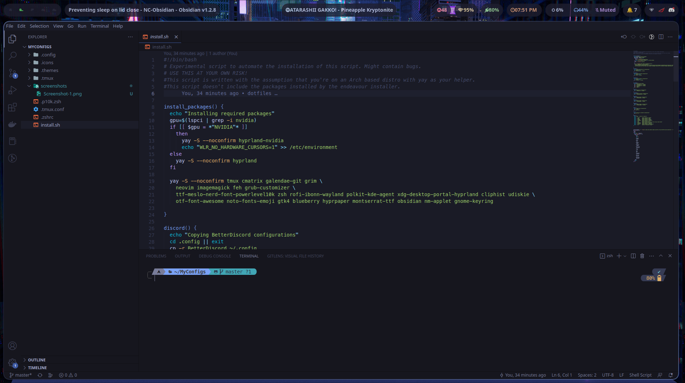
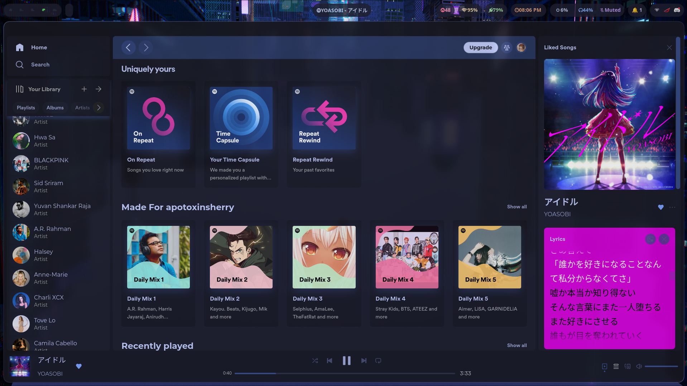
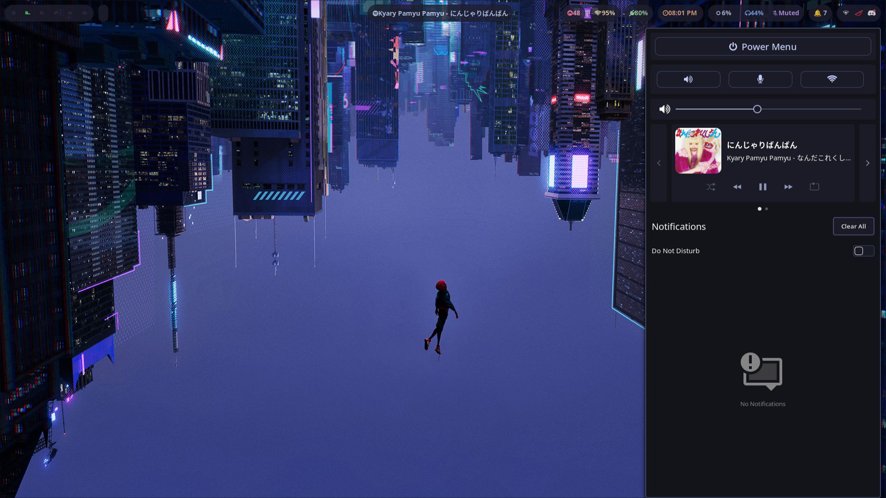
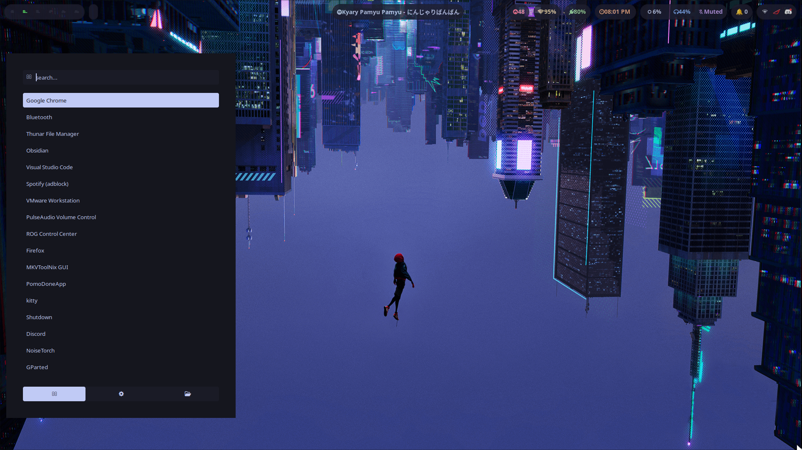
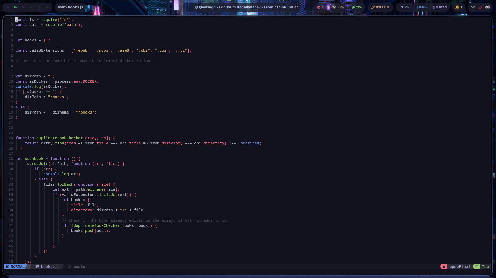

# dotfiles
Dotfiles for my Arch Linux setup. :cherry_blossom: 


- Distro: [EndeavourOS](https://endeavouros.com/)
- Window Manager: [Hyprland](https://github.com/hyprwm/Hyprland)
- Terminal: [Kitty](https://github.com/kovidgoyal/kitty)
- App Launcher: [Rofi (ibonn's fork) ](https://github.com/lbonn/rofi)
- Color Scheme: [Tokyo Night](https://github.com/enkia/tokyo-night-vscode-theme)
- Editor: [NvChad](https://github.com/NvChad/NvChad), VSCode
- Spotify Theming: [Spicetify](https://github.com/spicetify/spicetify-cli)
- Discord Theming: [BetterDiscord](https://github.com/BetterDiscord/BetterDiscord)


# Installation
<details>
  <summary>Manual Installation</summary>
  
  ### Packages
  
  #### Nvidia
  ```
    yay -S --noconfirm hyprland-nvidia cava tmux cmatrix galendae-git grim neovim \
    imagemagick feh ttf-meslo-nerd-font-powerlevel10k zsh rofi-ibonn-wayland polkit-kde-agent xdg-desktop-portal-hyprland \
    cliphist udiskie noisetorch otf-font-awesome noto-fonts-emoji gtk4 blueberry \
    hyprpaper montserrat-ttf nm-applet gnome-keyring
  ```
  Also add `WLR_NO_HARDWARE_CURSORS=1` to your `/etc/environment`
  
  #### Not Nvidia
  
  ```  
    yay -S --noconfirm hyprland cava tmux cmatrix galendae-git grim neovim \
    imagemagick feh ttf-meslo-nerd-font-powerlevel10k zsh rofi-ibonn-wayland polkit-kde-agent xdg-desktop-portal-hyprland \
    cliphist udiskie noisetorch otf-font-awesome noto-fonts-emoji gtk4 blueberry \
    hyprpaper montserrat-ttf nm-applet gnome-keyring
  ```
  
  
  Then, clone this git to your home directory
  
 </details>
 
 <details>
  <Summary>Installation Script</summary>
  <br>
  
  **:warning:WARNING: This script is not completely tested. Also, this script assumes that you're using an Arch based distro with yay as the helper.**
  
  ```
  Usage: ./install.sh [options]

  --swaync          Copies configs for swaync
  --tmux            Copies configs for tmux
  --waybar          Copies configs for waybar
  --wlogout         Copies configs for wlogout
  --spicetify       Copies configs for spicetify
  --rofi            Copies configs for rofi
  --gtk             Copies the gtk theme and its icons into your home folder
  --neofetch        Copies configs for neofetch
  --hyprland        Copies configs for hyprland
  --discord         Copies configs for BetterDiscord
  --all             Installs the necessary packages and copies all the config files. 
  --packages-only   Installs the necessary packages without copying the config files. 
  
  ```
  
  
 </details>

# Keybindings
The default super key is `Win` Key. Change it in `.config/hypr/configs/keybinds.conf`
|Program | Shortcut |
|--------- | ---------------|
| kitty | `Super + Enter` |
| rofi | `Alt + Space` |
| Exit application | `Super + Q` |
| Power Menu | `Super + Shift + Q`|
| Switch to workspace | `Super + Number`|
| Move current program to workspace | `Alt + Number`|
| Toggle floating | `Super + S` |
| Screenshot | `Super + Shift + S`|
| Clipboard | `Super + V` |
 
# Screenshots







# Notes

- Screenshots are stored in the `~/Pictures` folder, and are also copied to your clipboard. 
- This repository includes a working NvChad configuration, but it is better to fetch the latest version from their git.
- Similarly, this repository includes the tmux plugins, but it is better to fetch the latest version.  
